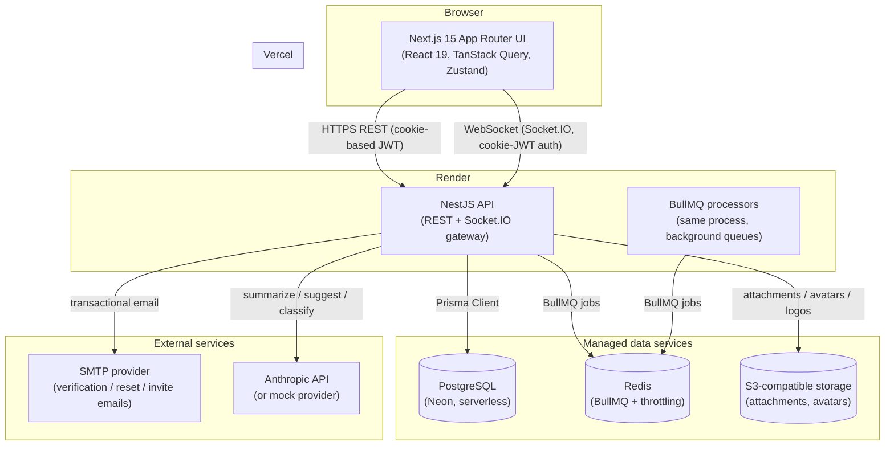

# Architecture

SentinelDesk is a two-app monorepo: a Next.js frontend and a NestJS backend, sharing a
single TypeScript contract package so the two never drift apart silently. This document
describes how the pieces fit together at runtime, not just where the files live.

## System diagram

## Request paths

**Authenticated REST call.** The frontend's `apiClient` (axios) attaches the httpOnly
access-token cookie automatically; state-changing requests also carry an `X-CSRF-Token`
header sourced from an in-memory store populated from response bodies (see
[Why CSRF isn't a cookie read](#csrf-across-origins) below). `JwtAuthGuard` → `RolesGuard`
→ `PermissionsGuard` → `CsrfGuard` run as global `APP_GUARD`s ahead of every controller,
so authorization is enforced centrally rather than per-route.

**Realtime updates.** The frontend opens one Socket.IO connection per session, authenticated
the same way (cookie-JWT, verified on the `connection` handshake). Clients join per-ticket
rooms (`ticket:join` / `ticket:leave`) so comment/typing events only fan out to sockets
actually viewing that ticket, plus a per-org room for org-wide notification pushes.

**Background work.** Ticket creation enqueues an AI-enrichment job (priority suggestion, tag
suggestion, duplicate/KB-suggestion pre-computation) rather than blocking the response.
SLA breach detection runs on a cron sweep, not per-request, since "has this ticket blown its
SLA" needs to be true even when nobody is actively viewing it. Webhook delivery is
fire-and-forget from the triggering request — a slow or down subscriber endpoint must never
slow down the API for the user who triggered the event.

## Backend module map

Each top-level directory under `apps/backend/src/` is a Nest module with its own
controller/service/DTO layering; modules depend on each other's *services* (never controllers)
via Nest's DI container.

| Module | Responsibility |
|---|---|
| `auth` | Signup (workspace + customer), login, refresh rotation, sessions, email verification, password reset, invites |
| `users` | Profile, avatar upload, team management (invite/role-change/suspend) |
| `tickets` | Ticket CRUD, comments/attachments, assignment, merge/split, escalation, tags, watchers, CSV export |
| `sla` | Business hours + holiday calendar, SLA policies, breach-check cron, dashboard/violations, simulator |
| `realtime` | Socket.IO gateway: room membership, typing indicators, presence, event fan-out |
| `notifications` | In-app notification records, unread counts, mark-read |
| `ai` | Provider-abstracted AI features (summarize, suggest reply, sentiment, duplicates, KB suggestions) + enrichment queue processor |
| `analytics` | Aggregate reporting (volume, SLA compliance, CSAT trends) + CSV/PDF export |
| `knowledge-base` | Article CRUD, publish workflow, AI-backed recommendations |
| `macros` | Saved-reply CRUD, insertable into the ticket composer |
| `saved-filters` | Per-user persisted ticket-list filter presets |
| `webhooks` | Subscription CRUD, HMAC-SHA256 signed delivery on ticket lifecycle events |
| `api-keys` | Public API key issuance/revocation, alternate `Authorization: Bearer` auth path |
| `organization` | Org profile + branding (name/logo/primary color) |
| `audit` | Org-wide audit log of security- and ticket-relevant actions |
| `health` | Liveness/readiness probe (`GET /api/health`) consumed by Render |
| `common` | Cross-cutting guards, decorators, sanitizers used by every other module |

## Frontend structure

The App Router tree under `apps/frontend/src/app/dashboard/` mirrors the backend module map
one level up — `tickets/`, `sla/`, `knowledge-base/`, `webhooks/`, `api-keys/`, `audit-logs/`,
`analytics/`, `team/`, `settings/` — each a route segment with its own page(s). Role-specific
dashboard *content* (what renders at `/dashboard` itself) lives in
`src/components/dashboard/{customer,agent,manager,admin}-dashboard.tsx`, selected by the
signed-in user's role rather than by route.

Data fetching goes through TanStack Query hooks in `src/hooks/` (one file per domain —
`use-tickets.ts`, `use-sla.ts`, etc.), never directly from components. Client-only UI state
(command palette open/closed, theme) lives in Zustand; everything that's actually server
state — tickets, SLA policies, notifications — lives in the Query cache, so there is a single
source of truth per resource and no risk of it drifting out of sync with the backend.

## Shared contract: `packages/types`

Every request/response shape both apps agree on — `TicketDetail`, `SlaPolicy`,
`UserProfile`, realtime event payloads, and so on — is defined once in
`packages/types/src/index.ts` and imported by both `apps/backend` and `apps/frontend`. There
is no code generation step: the backend's DTOs and Prisma-derived response shapes are
hand-kept in sync with these interfaces. This is a deliberate simplicity trade-off for a
single-team monorepo at this size — the moment the contract needs to be machine-verified
against the Prisma schema (multiple backend teams, external API consumers), generating this
package from `schema.prisma` would be the next step, and `api-keys`'s public API surface is
the part of this codebase most likely to need that first.

## Multi-tenancy model

Every tenant-scoped table carries an `organizationId` foreign key back to `Organization`,
and every service method that reads or writes one of those tables takes the *authenticated
user's* `organizationId` as a required parameter — there is no query path that trusts a
client-supplied org ID. This is row-level multi-tenancy (shared schema, shared database),
chosen over schema-per-tenant or database-per-tenant because it's the right trade-off for a
platform whose tenants are support teams, not because the alternatives weren't considered:
it keeps migrations, backups, and cross-tenant admin tooling to one thing each, at the cost
of relying on every query being correctly scoped rather than the database enforcing it
structurally. `@@index([organizationId, ...])` compound indexes throughout the schema exist
specifically so that reliance doesn't also cost query performance.

## CSRF across origins

The frontend and backend are deployed to different origins (`*.vercel.app` and
`*.onrender.com`), which breaks the textbook double-submit-cookie CSRF pattern: a CSRF
cookie set by the backend's domain is never visible to `document.cookie` on the frontend's
domain, no matter how permissive CORS is configured — that's a browser same-origin rule, not
a CORS setting. SentinelDesk works around this by echoing the CSRF token in the JSON body of
every response that would otherwise have relied on the client reading it from a cookie
(login, refresh, `GET /users/me`), and the frontend keeps that value in an in-memory store
that `CsrfGuard`-protected mutations read from instead of `document.cookie`. The cookie is
still set and still checked server-side (so the guard has something to compare against); it
is simply no longer the client's *source* for the header value.
