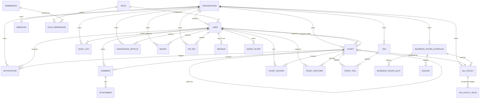

# Database

PostgreSQL via Prisma. The schema lives at
[`apps/backend/prisma/schema.prisma`](../apps/backend/prisma/schema.prisma) — this document
is a map of it, not a replacement for reading the real thing (every non-obvious column there
has an inline comment explaining why it exists).

## Entity-relationship diagram

Grouped by the same sections as the schema file itself. `Organization` is the tenancy root —
every other table either belongs to it directly or belongs to something that does.

## Design notes

**Every FK back to `Organization` is intentional, not incidental.** This is what makes
row-level multi-tenancy safe — see [Multi-tenancy model](architecture.md#multi-tenancy-model)
in the architecture doc for how that's enforced at the service layer, not just the schema
layer.

**`TicketHistory` vs `AuditLog`.** These look similar and are easy to conflate, so they're
worth distinguishing explicitly: `TicketHistory` is the per-ticket timeline a user sees on
the ticket detail page (assigned, status changed, comment added, ...) — narrative, ticket-
scoped. `AuditLog` is the org-wide security/compliance trail (`GET /audit-logs`, admin-only)
— broader in scope (covers non-ticket actions like team management) and structured for
querying by actor/action/time rather than for display on one ticket's page. A ticket-relevant
event that matters for compliance (e.g. an escalation) writes to *both*, for different
readers.

**`Ticket.mergedIntoId` / `splitFromId` are self-referential FKs, not a join table.** Merge
and split are both 1:1 ticket-to-ticket relationships from the schema's point of view (a
ticket merges into exactly one surviving ticket; a ticket splits off from exactly one
origin), so they're modeled as nullable self-FKs with named Prisma relations
(`"TicketMerge"`, `"TicketSplit"`) rather than a generic ticket-links table — simpler to
query, and the schema itself documents the cardinality instead of leaving it to application
code to enforce.

**Money-shape fields default in code, not just in the schema.** `SlaPolicyRule` stores raw
`responseTargetMinutes` / `resolutionTargetMinutes` integers rather than a richer duration
type — business-hours-aware due-date math (`apps/backend/src/sla/business-hours.util.ts`)
needs a plain number to add, and Postgres has no duration type worth reaching for here that
Prisma maps cleanly.

**Soft-delete is deliberately not used anywhere.** Rows are either hard-deleted (cascade via
FK, e.g. deleting an `Organization` cascades everything) or never deleted, depending on
whether the domain has a real "this no longer exists" state (a revoked API key still needs
its row to exist for the audit trail — that's `ApiKey`, never actually deleted, just no
longer matchable) versus a "this was removed" state that has no downstream meaning (a saved
filter someone deletes has no reason to leave a tombstone).

**Every hashed secret is genuinely hashed, not encrypted-and-reversible.** Refresh tokens
(`Session.refreshTokenHash`), email verification / password reset / invite tokens, and API
keys (`ApiKey.keyHash`) all store a one-way hash. The API key's cleartext prefix
(`ApiKey.keyPrefix`) is the one deliberate exception — kept *only* so the UI can render
`sk_live_ab12••••` for a human to recognize which key is which, never enough of the secret to
reconstruct or brute-force the rest.

## Regenerating this diagram

If you change `schema.prisma`, update the Mermaid block above by hand — there's no
schema-to-diagram generation step in this repo (see the trade-off note on `packages/types`
in [architecture.md](architecture.md#shared-contract-packagestypes); the same "hand-kept in
sync, machine generation is the next step if scale demands it" reasoning applies here).
