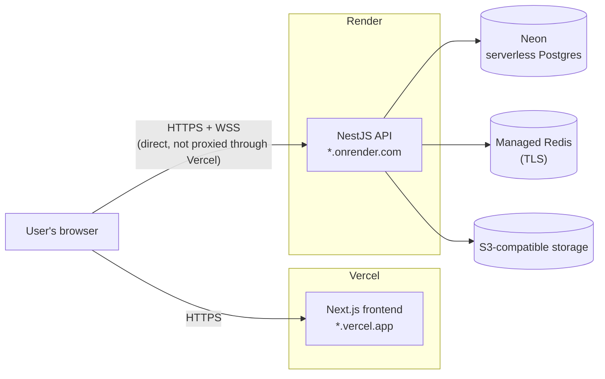

# Deployment

SentinelDesk runs as two independently deployed services — a NestJS API on Render and a
Next.js frontend on Vercel — plus managed Postgres and Redis. This document describes the
flow actually used to run this repo's live deployment, including the failure modes that were
hit and fixed along the way, not just a generic "how you'd deploy any Next.js/Nest app"
walkthrough.

## Topology



The frontend and backend are on **different origins by design** — Vercel doesn't run
arbitrary long-lived Node processes (WebSocket servers, BullMQ workers) the way this backend
needs, so proxying isn't an option. That cross-origin split is also *why* the CSRF token has
to be echoed in response bodies instead of read from a cookie — see
[CSRF across origins](architecture.md#csrf-across-origins) in the architecture doc.

## Backend — Render

The backend deploys from [`render.yaml`](../render.yaml) as a Render **Blueprint**, so the
build/start commands and env var *names* are version-controlled; only secret *values* are
set in the Render dashboard (every `sync: false` entry in the blueprint).

**Build command:**
```
npx pnpm@latest install --frozen-lockfile --prod=false &&
npx pnpm@latest --filter @sentinel-desk/backend exec prisma generate &&
npx pnpm@latest --filter @sentinel-desk/backend build
```

**Start command:**
```
for i in 1 2 3 4 5; do
  npx pnpm@latest --filter @sentinel-desk/backend exec prisma migrate deploy && break;
  echo "migrate deploy attempt $i failed - retrying in 8s..."; sleep 8;
done &&
npx pnpm@latest --filter @sentinel-desk/backend exec prisma db seed &&
node apps/backend/dist/main.js
```

Health check: `GET /api/health`.

### Why the build/start commands look like this

Three real deploy failures shaped this, in the order they were hit:

1. **`corepack enable` fails with `EROFS`.** Render's build container ships a read-only
   `/usr/bin`, and `corepack enable` needs to write a `pnpm` symlink there. `npx pnpm@latest`
   sidesteps this entirely — npx caches the package under the user's own npm cache dir, no
   write to a system path required.
2. **`--prod=false` on install.** Render sets `NODE_ENV=production` before the build runs,
   which makes a plain `pnpm install` skip `devDependencies` — but `prisma` (the CLI),
   `@nestjs/cli`, and `typescript` all live there, and the build genuinely shells out to all
   three (`prisma generate`, `nest build`, and the start command's `prisma migrate deploy`).
   `--prod=false` overrides that skip for this one install.
3. **Neon cold-start races Prisma's advisory-lock timeout.** Neon's serverless Postgres
   suspends compute when idle. The first connection after a deploy wakes it, which routinely
   takes longer than Prisma's ~10s advisory-lock timeout on `migrate deploy` (error `P1002`)
   — a bare single attempt failed deploys intermittently even though the database was
   perfectly healthy seconds later. The retry loop (5 attempts, 8s apart) waits it out instead
   of failing the deploy.

**`prisma db seed` runs on every deploy, not just the first one.** The seed script
(`apps/backend/prisma/seed.ts`) is upsert-based throughout, so re-running it is a no-op once
the data already matches. This is deliberate: it keeps the demo accounts
(`admin@acme.com` etc., password `Password123!`) present even after a database reset,
so the login page's one-click demo buttons keep working without a manual re-seed step.

**Seeding uses `ts-node --transpile-only`, not plain `ts-node`.** Render's free-tier instance
has 512MB of memory. Plain `ts-node`'s type-checking pass on the seed script was enough to
OOM-kill the process during deploy; `--transpile-only` skips type-checking (already covered
by CI) and just runs the JS, using a fraction of the memory.

### Environment variables set in the Render dashboard

Everything marked `sync: false` in `render.yaml` — `DATABASE_URL`, `REDIS_HOST` /
`REDIS_PORT` / `REDIS_PASSWORD` / `REDIS_TLS`, `FRONTEND_URL`, `BACKEND_URL`, SMTP
credentials, S3-compatible storage credentials, and `ANTHROPIC_API_KEY`. `JWT_ACCESS_SECRET`,
`JWT_REFRESH_SECRET`, and `COOKIE_SECRET` are generated by Render itself
(`generateValue: true`) rather than supplied — nobody needs to know them, they just need to
be stable across restarts of the same service, which Render guarantees.

Redis in production needs `REDIS_TLS=true` and a password — see
`apps/backend/src/config/configuration.ts` for how the Redis connection factory conditionally
adds `tls: {}` to the ioredis/BullMQ connection options based on that flag; this only matters
because local dev's Docker Compose Redis has neither.

## Frontend — Vercel

The Vercel project points at this repo with **Root Directory** set to `apps/frontend`.
Vercel's pnpm-workspace detection handles installing the monorepo's shared dependencies
(including `@sentinel-desk/types`) automatically from that root directory setting — no custom
build command is needed beyond the framework default (`next build`).

**Environment variables** (Vercel dashboard, Production + Preview):

| Variable | Value |
|---|---|
| `NEXT_PUBLIC_API_URL` | the Render backend's URL, e.g. `https://sentinel-desk-api.onrender.com` |
| `NEXT_PUBLIC_WS_URL` | same as above — the Socket.IO client negotiates the websocket upgrade itself from an http(s) origin, it does not want a literal `ws://` URL |
| `NEXT_PUBLIC_APP_NAME` | `SentinelDesk` |

Vercel auto-deploys on every push to `main`; Render's blueprint deploy is **manual** (a
"Deploy latest commit" click in the Render dashboard) unless auto-deploy is explicitly
enabled for the service — worth knowing so a backend change doesn't silently sit un-deployed
after a push while the frontend that depends on it goes live immediately.

### The CSRF bug this split caused in production

Before the fix described in
[CSRF across origins](architecture.md#csrf-across-origins), ticket creation and other
CSRF-guarded mutations failed in production with "Invalid or missing CSRF token" while
working perfectly in local dev — because local dev's frontend and backend share a
`localhost` cookie domain (just different ports), so `document.cookie` reads worked there and
masked the bug until the app was actually running cross-origin. This is the reason that fix
exists at all, and the reason it's worth calling out here specifically: **any cross-origin
frontend/backend split with cookie-based CSRF will hit this**, not something specific to
Render+Vercel.

## Database migrations in production

Migrations run automatically on every backend deploy (`prisma migrate deploy` in the start
command, ahead of `db seed`). There is no separate manual migration step — a schema change
only needs `apps/backend/prisma/migrations/` to contain the new migration (generated locally
via `prisma migrate dev`) and be committed; the next Render deploy applies it.

## Local development

See the root [README](../README.md#getting-started) for the local Docker Compose flow
(Postgres, Redis, MinIO, MailHog) — production swaps each of those for a managed equivalent
(Neon, managed Redis with TLS, S3-compatible storage) but the application code path is
identical either way; only the connection env vars differ.
